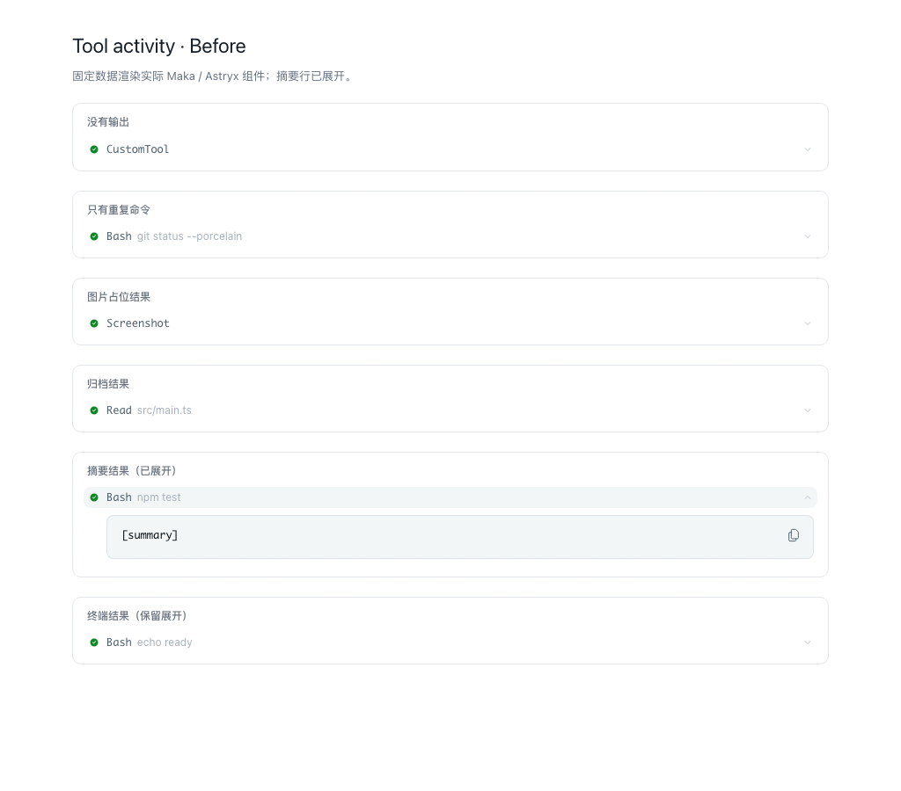
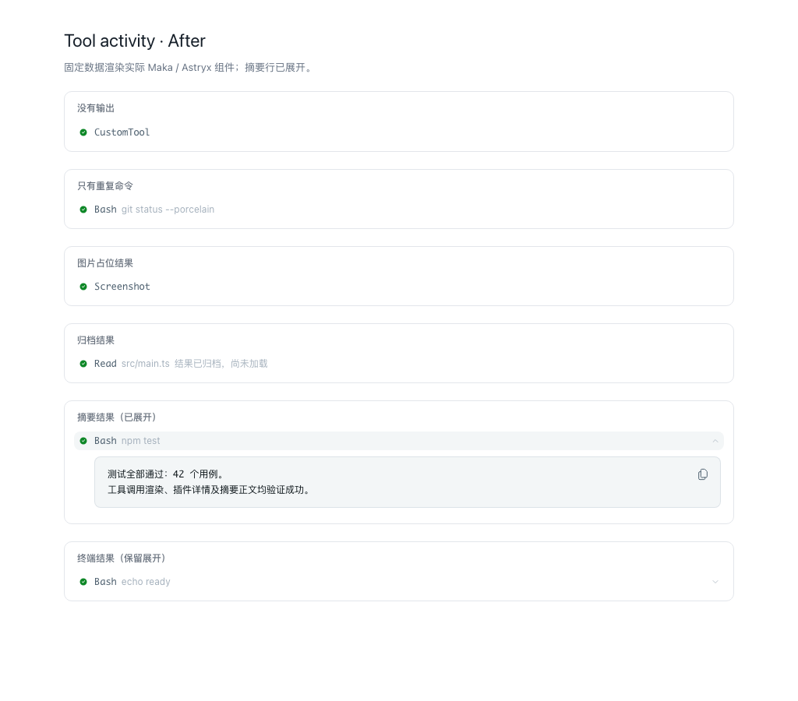

<!--
  Licensed to the Apache Software Foundation (ASF) under one
  or more contributor license agreements.  See the NOTICE file
  distributed with this work for additional information
  regarding copyright ownership.  The ASF licenses this file
  to you under the Apache License, Version 2.0 (the
  "License"); you may not use this file except in compliance
  with the License.  You may obtain a copy of the License at

      http://www.apache.org/licenses/LICENSE-2.0

  Unless required by applicable law or agreed to in writing,
  software distributed under the License is distributed on an
  "AS IS" BASIS, WITHOUT WARRANTIES OR CONDITIONS OF ANY
  KIND, either express or implied.  See the License for the
  specific language governing permissions and limitations
  under the License.
-->

# fix(ui): hide empty tool details and render summary bodies

## Summary

Tool rows previously always received a `resultDetail` element, so calls with no new information displayed a chevron and opened an empty or placeholder panel. Rows now omit `resultDetail` for empty bodies, repeated untitled single-line invocation text, and image/archive placeholders. Summary results display their `summarized` body with the same redaction, localization and line cap as text results. Archived results show a localized status in row stats.

The synchronous slot registry supports exact tool-name matching. `ToolTrow` subscribes once to the keyed `conversation.tool.detail` slot using its numeric version, then checks active keys for each row. Matching plugin contributions keep details expandable; unrelated, disposed and abdicated contributions do not.

For `argsOnly`, the full trimmed body must equal the displayed target to omit details. Multiline or longer arguments remain expandable when the row omits part of their content. Quiet invocation text uses the row's shared first-line, trim and 120-character cap when comparing; existing intent formatting remains unchanged. Live output and sandbox/bypass decorations keep details available.

The screenshots render actual Maka/Astryx components with fixed fixtures and the built desktop stylesheet in Chromium. They are component evidence, not screenshots of a live provider session. Before uses the fetched `main` implementation (`5735554b6`); after uses this change. The summary row is expanded in both. The four placeholder/repeated rows lose their chevrons, and the terminal row retains its chevron.

## Verification

- Relevant rendering and plugin suites: 42 passed, including 9 new regression tests.
- Full UI suite: 698 passed.
- New tests against the original implementation: 7 fail, 2 pass.
- `npm run lint`, `npm run format:check`, `npm run build`, and `npm run typecheck`: passed.
- `npx knip --workspace apps/desktop --workspace packages/ui`: passed.
- `npm run check:locale-hygiene`: passed. The requested pnpm invocation was rejected by the repository's npm package-manager pin, so the same script was run with npm.
- Chromium fixture capture: 6 expandable rows before, 2 after.
- Full cross-workspace test suite and live application/provider testing were not run.

## AI use

- [ ] No generative tool made a substantive contribution
- [x] Generative tooling made a substantive contribution

Tool(s) and scope: OpenAI Codex implemented the UI changes, regression tests and review evidence. Human review and submission remain with the contributor of record.

## Checklist

- [x] Tests cover the change and fail without it
- [x] Lint, format, typecheck and the affected suites pass locally

Does this PR entail a change in behavior?

- [x] Yes — described under Summary above
- [ ] No
